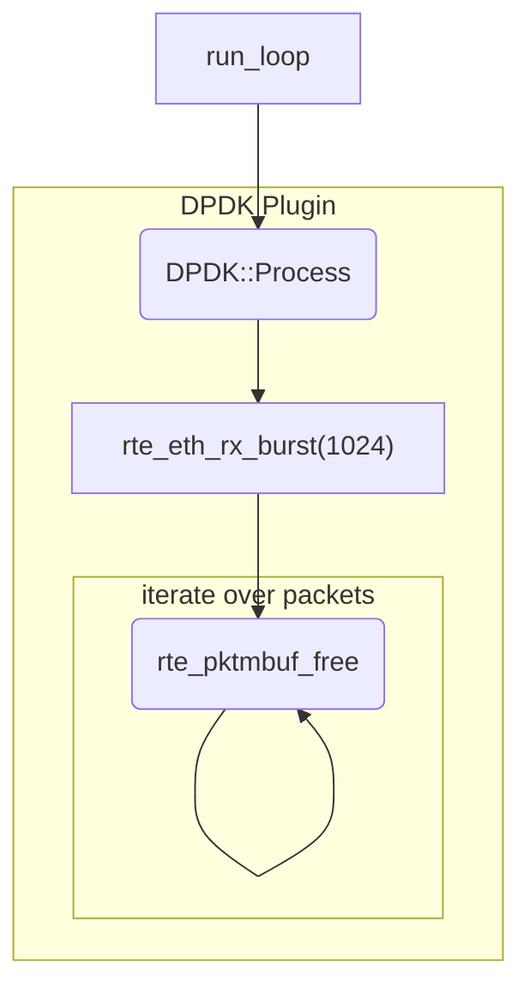

# Performance Analysis

## noop

The following code path illustrates a noop. DPDK gets packets as fast as it can, and then does nothing with them.

Performance for the noop case is line-rate, almost all 10 million packets were successfully received.

## Naive Approach

In this approach, a burst of packets are fetched, then each is sent one by one into Zeek for processing.

Here, only 2.7M packets are received.