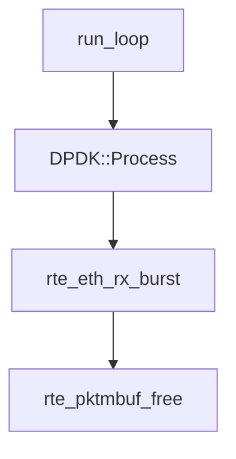

# Performance Analysis

The following code path illustrates a noop. DPDK gets packets as fast as it can, and then does nothing with them.

Performance for the noop case is line-rate, almost all 10 million packets were successfully received.